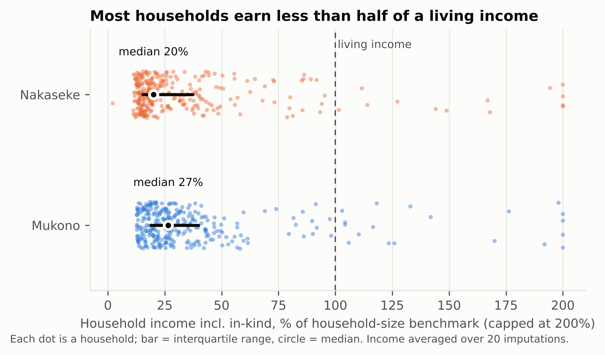
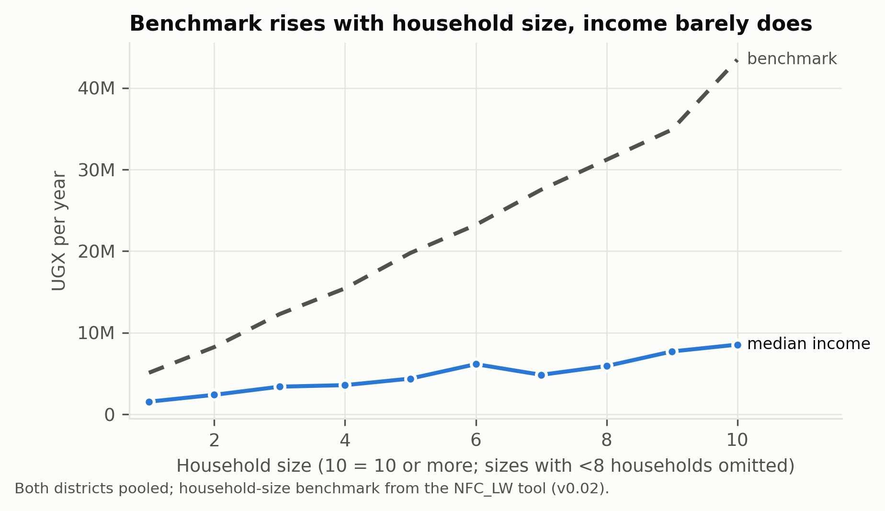
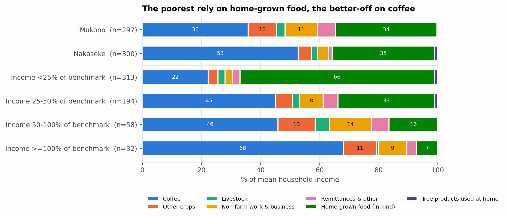
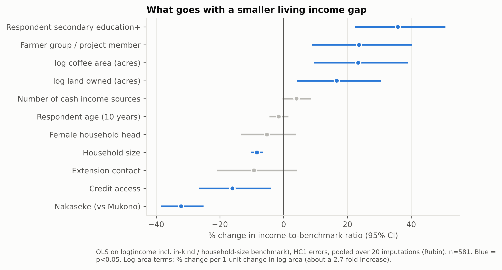
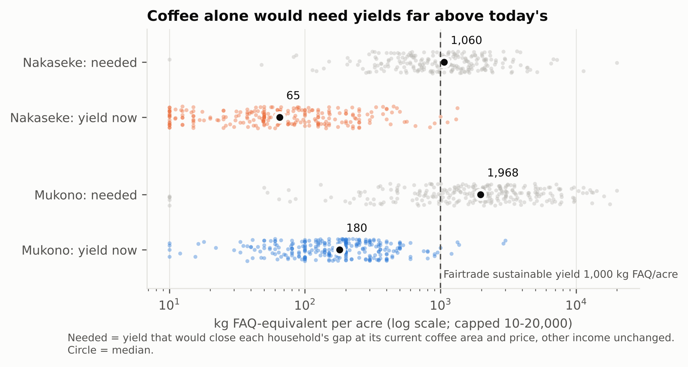

<!-- Exported from the shared Paper 1 draft v2 doc (rev 44, 2026-10-07). The doc is the working copy; re-export after edits. -->

# Paper 1 draft v2 – Living income gap, Robusta coffee, Uganda

Oct 5, 2026 · @Ezra

**Working title:** Far from a living income: the size, composition and drivers of the living income gap among Robusta coffee households in Mukono and Nakaseke, Uganda

**Note to co-authors (remove before submission).** This version replaces all results of v1 with the rebuilt analysis of 5 October 2026: benchmark v0.02 from the NFC\_LW tool (reference household of 2 adults and 3 children), cleaned and imputed income, and home-grown food valued as income. The v1 figures (USD 1,332 benchmark; 83.2% below; "non-coffee tree products 11.4%") came from an earlier benchmark and from survey item Q162e, which is sale of other crops, not tree products. The introduction keeps Ezra's text and answers Aske's comments; the focus group synthesis is kept. Open points are marked **\[to confirm\]**.

## Abstract

Robusta coffee is Uganda's leading agricultural export, yet the households that grow it often cannot afford a decent standard of living. We estimate the living income gap of 597 coffee-farming households in Mukono and Nakaseke districts, central Uganda, and ask what it would take to close it. Living income benchmarks were built with the NFC\_LW tool from local market prices and survey data: UGX 20.2 million per year in Mukono and UGX 19.8 million in Nakaseke for a household of two adults and three children. Household income combined twelve-month cash income from eight sources (missing amounts imputed 20 times) with the value of home-grown food and tree products used at home.

Median household income was UGX 5.5 million in Mukono and 3.8 million in Nakaseke, 27% and 19% of the benchmark; 93% and 98% of households fell below it. Cash income alone reached 12% and 7% of the benchmark, and income net of production costs 20% and 13%. Coffee provided 36% and 53% of income and home-grown food about 35%; for the poorest half of households, home-grown food was the largest single source. Income relative to the benchmark rose with education, farmer-group membership, coffee area and land, and fell with household size. Median coffee yields of 180 and 58 kg FAQ per acre would have to rise roughly 11–14 fold for coffee alone to close the gap. Closing it will therefore take a mix of higher coffee productivity, more land-efficient diversification, including the tree component of coffee agroforestry, and support for large households. Four focus group discussions point to credit, inputs and market access as the barriers farmers feel most.

**Keywords:** living income, Robusta coffee, coffee agroforestry, smallholder farmers, income diversification, Uganda

## 1 Introduction

Coffee is Uganda's most valuable agricultural export. In 2025 the country exported coffee worth about USD 2.5 billion, second in Africa only to Ethiopia (MAAIF, 2026), and production is dominated by smallholders farming one or two acres. In central Uganda, Robusta coffee (*Coffea canephora*) is often called a "pension crop": a source of cash that households draw on for school fees, health care and emergencies over decades (Mbowa et al., 2017; Samuel et al., 2023). National output has grown, yet the farmers who produce it remain poor, and many are food insecure. Falling yields under a changing climate, small and fragmented plots, and volatile farm-gate prices all squeeze their incomes (Mukasa et al., 2025).

This is the paradox the paper addresses: a household can take part in a high-value global commodity chain for its whole working life and still not earn enough for a decent standard of living. The paradox is not that coffee earns nothing, but that the income it earns on a typical smallholding is far smaller than what a decent life costs locally. Farmers pay for inputs and labour, and for food, health care, schooling and housing, out of income that arrives once or twice a year at an uncertain price. Waarts et al. (2021) describe the result as a low-input, low-output trap.

Efforts to improve rural livelihoods are framed by SDG 1 (no poverty) and SDG 2 (zero hunger), which both rest on households earning enough, and steadily enough, to meet their basic needs and absorb shocks (Minos, 2018; van de Ven et al., 2021). Poverty is usually measured against the World Bank's international poverty line, but scholars and rural development practitioners argue that such lines do not describe a decent standard of living (Anker & Anker, 2017; Minos, 2018; van de Ven et al., 2021; Waarts & Janssen, 2019). This has led to the living income concept.

**Living income.** A living income is the net annual income a household needs to afford a decent standard of living in a given place: a nutritious diet, decent housing, health care, education, clothing, transport and provision for unexpected events (Anker & Anker, 2017; van de Ven et al., 2021). Unlike an international poverty line, a living income benchmark is built from local prices and local standards, so it can be compared directly with what households earn. The difference between the two is the living income gap. Benchmarks for rural Uganda are well above the international poverty line; the Fairtrade living income reference price for Ugandan coffee, for example, rests on a benchmark for a household of five **\[to confirm: cite Fairtrade 2022 benchmark value\]**.

**Coffee agroforestry.** In central Uganda, Robusta is usually grown in diversified coffee agroforestry systems (CAS), most often with banana, which gives quick returns as shade, food and cash (Sebukyu & Mosango, 2012; Samuel et al., 2023). CAS also regulate microclimate, protect soils and store carbon (Koutouleas et al., 2022). They are promoted for these economic and ecological benefits, but the benefits vary with farm size, tree density and diversity, management, labour, extension and access to markets for coffee and other products (Nasiro, 2024; Tebkew et al., 2024). Whether CAS can help close the living income gap is therefore an empirical question, and one that depends on how households actually earn their income.

**Study districts.** Mukono and Nakaseke are both Robusta-producing districts in central Uganda but differ in livelihoods. Mukono, in the Lake Victoria Crescent agro-ecological zone, is close to Kampala; peri-urban growth brings markets and off-farm jobs but also pressure on land. Nakaseke, in the central wooded savanna, is more rural and more dependent on agriculture, with poorer access to markets, services and other income. Farmers in both districts face fragmented land, labour shortages, limited credit and inputs, weak extension and volatile farm-gate prices. Comparing the two shows how land, market access, diversification and dependence on coffee shape the living income gap.

**Research questions.** The study asks:

1. How large is the living income gap among Robusta coffee households in central Uganda, and how is it distributed across households and districts?
2. Which income sources and household and farm characteristics are associated with being closer to a living income, and what pathways could close the gap?

Section 2 describes the study area, sampling, data and methods; Section 3 presents the benchmark, the gap, income composition, its drivers and living conditions; Section 4 discusses pathways and limitations; Section 5 concludes.

## 2 Materials and methods

### 2.1 Study design and area

The study used a cross-sectional mixed-methods design: a structured household survey, a market price assessment, a farm-level tree inventory and four focus group discussions. It covered two sub-counties in each district, Kimenyedde and Nabaale in Mukono and Kasangombe and Kikamulo in Nakaseke, spanning rural and peri-urban locations to capture differences in market access, prices and livelihoods. **\[Study map to add.\]**

### 2.2 Sampling and household survey

The sampling frame was the coffee-growing households of each district. According to the Uganda Bureau of Statistics, 7,086 of the 34,254 crop-growing households in Nakaseke and 9,322 of the 87,269 in Mukono grow coffee (UBOS, 2017).

The target sample size was set with Cochran's (1977) formula for estimating a proportion, n₀ = z²·p(1 − p)/E², with z = 1.96 (95% confidence), p = 0.5 (the most conservative assumption) and a margin of error E = 0.05, which gives n₀ = 384. Applying the finite population correction, n = n₀ / \[1 + (n₀ − 1)/N\], with N the number of coffee-growing households, gave a target of 369 households in Mukono and 365 in Nakaseke.

Budget and time limited fieldwork to 300 households per district, about 150 in each of the two study sub-counties. With the finite population correction, the achieved samples give a margin of error of ±5.6% in Mukono and ±5.5% in Nakaseke at 95% confidence (p = 0.5), rather than the planned ±5%. This precision is sufficient for the district-level comparisons in this paper, but estimates for subgroups, such as income groups or sub-counties, are less precise and are interpreted with care.

Eligible households grew Robusta coffee, lived in the study sub-counties and had a consenting adult who knew the household's farm and finances. From each trading centre the team chose a direction of travel at random, selected the first eligible household at random and then approached every third household. Absent respondents were revisited rather than replaced, and where several eligible households shared a homestead one was chosen at random. This limited enumerator discretion and spread the sample geographically.

Trained enumerators interviewed respondents face to face with a KoboToolbox questionnaire on mobile devices between September and December 2025. The data set holds 600 interviews; three without a recorded district were excluded, leaving 597 for analysis (297 in Mukono and 300 in Nakaseke) **\[v1 reported 300 Mukono interviews; the data hold 297\]**. The questionnaire recorded each household member's age group, sex, relationship to the head, education, occupation and residence; housing, water, sanitation, energy and other living conditions; land and coffee area, coffee harvests and farm-gate prices; management costs; tree products harvested, sold and used at home; and cash income in the past twelve months from eight sources (coffee, livestock, off-farm employment, remittances, other crops, trade, professional employment and other). Each expense was recorded with its reference period so that all amounts could be converted to a year.

### 2.3 Living income benchmark

Benchmarks were estimated for each district with the NFC\_LW benchmark tool, which follows the Anker methodology (Anker & Anker, 2017) as adapted for rural households by NewForesight and van de Ven et al. (2021). The benchmark is the annual cost of a decent standard of living for a reference household of two adults and three children, the sum of five components:

- **Food:** the cost of a low-cost nutritious model diet, valued at district market prices collected in July 2025 in Kasawo and Nakifuma town councils (Mukono) and Nakaseke and Kiwoko town councils (Nakaseke), scaled to each household member's energy needs.
- **Housing:** the cost per room of decent local housing, including utilities and cooking fuel, at a maximum of two persons per room.
- **Non-food, non-housing (NFNH) needs:** health care, education, transport, clothing, communication and other essentials, from survey data on the 15 most complete households per district.
- **Elder care:** 5% of housing, food and NFNH costs.
- **Margin for unexpected events:** 5% of food, NFNH and elder care costs, as specified in the tool.

Several formula errors in the earlier version of the tool were corrected, and all components were re-estimated with district prices and survey data (benchmark version v0.02). The same tool formulas were applied to each household's own composition to obtain a household-size-specific benchmark, used alongside the reference-household benchmark.

### 2.4 Household income

Household income was defined as gross annual income including income in kind:

- **Cash income** from the eight sources over the past twelve months. A source a household did not list was set to zero. Missing coffee income was taken from reported seasonal coffee sales. Other missing amounts were imputed by predictive mean matching (20 imputations), and every statistic was computed on each imputation and then pooled.
- **Home-grown food:** the household's model-diet food need multiplied by the share of food consumption that comes from own production, by food group (Nambooze et al., 2025). Low and high variants used half the own-production share and all food not bought. Food appears on both sides of the comparison: its cost is part of the benchmark, and the share a household grows itself is income received in kind rather than in cash. Leaving it out would treat a household that eats its own maize and beans as poorer than one that sells coffee to buy the same food, although both have met the need (Anker & Anker, 2017). Because the in-kind value is taken from the benchmark's own food basket, both sides use the same diet and prices; cash income is reported alongside it.
- **Tree products used at home** that are not food (firewood, poles, bark, leaves), valued at reported farm-gate prices and capped at the 95th percentile. Tree food products were not added, to avoid double counting with home-grown food.

As a sensitivity analysis, net income subtracted annual cash production costs: hired labour (labour days per acre from the Fairtrade living income reference price for Ugandan Robusta (Fairtrade, 2022), multiplied by coffee area and the reported daily wage, capped at UGX 25,000), fertiliser and manure, seedlings, mulching and thinning, coffee rehabilitation and land rent for households that do not own their land. Family labour was not costed in the main estimate. Labour days were set for coffee, and the costs of growing food crops were not recorded separately, so net income is an upper estimate.

### 2.5 Analysis

The living income gap is the benchmark minus household income; we also report income as a percentage of the benchmark. Households were grouped by income as a share of their household-size benchmark (below 25%, 25–50%, 50–100%, 100% or more). Differences between districts were tested with Mann–Whitney U and chi-square tests, and across income groups with Kruskal–Wallis and chi-square tests.

To identify correlates of being closer to a living income, we regressed the log of income relative to the household-size benchmark on district, coffee area, land owned, household size, sex of the household head, education and age of the respondent, number of cash income sources, farmer-group membership, extension contact and credit access. Models used heteroscedasticity-robust (HC1) standard errors, were estimated on each of the 20 imputations and were pooled with Rubin's rules. Further models added coffee yield and price, trees on the farm, net instead of gross income, a logit of reaching half the benchmark, and enumerator fixed effects. To gauge the coffee pathway, we calculated for each household the yield, price or coffee area that would close its gap with other income unchanged. Coffee yields are expressed in kg of fair average quality (FAQ) coffee, converting dry cherry (*kiboko*) at 0.5 kg FAQ per kg **\[to confirm the conversion\]**.

### 2.6 Focus group discussions

Four sex-disaggregated focus groups of about ten farmers each (40 participants) were held in Kireeta Parish, Kikamulo Sub-county (Nakaseke) and Bamusuuta A Parish, Nabaale Sub-county (Mukono), coded N1F, N2M, M1F and M2M. They explored what a decent standard of living means locally, expenditure priorities, income sources, access to gendered products, market risks and barriers to a living income.

### 2.7 Data quality and ethics

Submitted questionnaires were checked for completeness, consistency, duplicates, extreme values and units, and questionable values were checked with enumerators where possible. Analysis-stage cleaning corrected keying errors in child counts, converted reference periods and set implausible values (for example coffee yields above 5,000 kg FAQ per acre) to missing. One Nakaseke enumerator recorded far higher tree counts than the others (median 258 trees per farm against 5–17), probably counting coffee bushes; these counts were excluded from the tree analysis. All scripts and decisions are documented for reproducibility.

The study was approved by the Makerere University College of Agricultural and Environmental Sciences Research Ethics Committee, and a research permit was granted by the Uganda National Council for Science and Technology **\[add approval numbers\]**. Participation was voluntary, informed consent was obtained before each interview, and personal identifiers were separated from the analysis data.

## 3 Results

### 3.1 Living income benchmark

A decent standard of living for two adults and three children costs UGX 20.2 million a year in Mukono and UGX 19.8 million in Nakaseke (Table 1). Food and NFNH needs make up about 80% of the benchmark in both districts. Housing costs more in Nakaseke (13% against 9%), while food costs more in Mukono.

**Table 1.** Living income benchmark for the reference household (2 adults, 3 children), benchmark tool v0.02

| Component | Mukono (UGX/month) | Mukono (% of total) | Nakaseke (UGX/month) | Nakaseke (% of total) |
| --- | --- | --- | --- | --- |
| Food | 713,711 | 42.5 | 643,882 | 39.1 |
| Non-food, non-housing | 664,544 | 39.5 | 649,487 | 39.4 |
| Housing (incl. utilities, cooking fuel) | 153,005 | 9.1 | 211,247 | 12.8 |
| Elder care | 76,563 | 4.6 | 75,231 | 4.6 |
| Margin for unexpected events | 72,741 | 4.3 | 68,430 | 4.2 |
| **Total per month** | **1,680,564** | **100** | **1,648,277** | **100** |
| **Total per year** | **20.17 million** |  | **19.78 million** |  |

**\[To add: USD values at the 2025 average exchange rate, and the model diet's energy and nutrient checks from the tool.\]**

### 3.2 Size and distribution of the living income gap

Most households earn a quarter of a living income or less (Table 2, Figure 1). Median income including home-grown food was UGX 5.5 million in Mukono and 3.8 million in Nakaseke: 27% and 19% of the benchmark. Almost all households fell below it, 93% in Mukono and 98% in Nakaseke, and the median household would need another UGX 14.7 million and 16.0 million a year.

**Table 2.** Living income gap by district (medians; pooled over 20 imputations)

| Measure | Mukono | Nakaseke |
| --- | --- | --- |
| Households | 297 | 300 |
| Income incl. home-grown food (UGX/year) | 5.51 million | 3.82 million |
| Cash income only (UGX/year) | 2.40 million | 1.40 million |
| Income as % of reference benchmark | 27.3 | 19.3 |
| Cash income as % of benchmark | 11.9 | 7.1 |
| Range with low–high home-food valuation (%) | 20.5–29.2 | 13.5–21.1 |
| Net income (after production costs) as % of benchmark | 19.8 | 12.9 |
| Households below reference benchmark (%) | 92.6 | 97.6 |
| Households below household-size benchmark (%) | 93.9 | 95.5 |
| Gap to reference benchmark (UGX/year) | 14.65 million | 15.96 million |
| Gap to household-size benchmark (UGX/year) | 13.75 million | 13.03 million |

**Figure 1.** Household income including home-grown food as a percentage of the household-size benchmark. Each dot is a household; bar = interquartile range, circle = median.

The finding does not depend on how home-grown food is valued: even at the high valuation, the median household reaches 29% and 21% of the benchmark. Subtracting production costs lowers the ratio to 20% and 13%; if family labour is also costed at the wage, it falls to 18% and 9%. About 5% of Nakaseke households had negative net income.

### 3.3 Who is furthest from a living income

Half of all households (313 of 597) earn less than 25% of the benchmark for their household size. They are larger, more often headed by women, less educated and farm less land than households closer to a living income (Table 3). Age and farming experience did not differ.

**Table 3.** Household characteristics by income as % of the household-size benchmark (medians or %)

| Characteristic | < 25% | 25–50% | 50–100% | ≥ 100% | p |
| --- | --- | --- | --- | --- | --- |
| Households | 313 | 194 | 58 | 32 |  |
| Household size (members) | 6 | 4 | 4 | 3 | < 0.001 |
| Dependency ratio | 2.0 | 1.7 | 2.0 | 1.4 | 0.030 |
| Female household head (%) | 55.8 | 55.2 | 39.7 | 31.2 | 0.009 |
| Respondent with secondary education or more (%) | 26.9 | 34.0 | 60.3 | 65.6 | < 0.001 |
| Land owned (acres) | 2.0 | 2.0 | 3.0 | 5.0 | < 0.001 |
| Coffee area (acres) | 1.0 | 1.0 | 1.5 | 3.0 | < 0.001 |
| Member of farmer group or project (%) | 14.9 | 25.8 | 38.6 | 25.0 | < 0.001 |

Household size matters because the benchmark rises steeply with each member while income barely does (Figure 2). Part of this is by construction, as both the benchmark and the value of home-grown food scale with household size.

**Figure 2.** Household-size benchmark and median household income by household size, both districts.

### 3.4 Income composition

Coffee and home-grown food together provide about 70% of household income in both districts. Coffee provides 36% in Mukono and 53% in Nakaseke; home-grown food about 35% in both. Mukono households earn more from other crops (10% against 4%) and from non-farm work and business (11% against 4%). Almost every household sold coffee, about half sold other crops and about 30% received remittances; off-farm employment reached 10% of households in Mukono and 24% in Nakaseke.

The mix changes sharply with income (Figure 3). For households below 25% of the benchmark, home-grown food is two-thirds of income and coffee a fifth. For those at or above the benchmark, coffee is two-thirds and home-grown food 7%. The poorest households are therefore not less dependent on farming; they are more dependent on what they eat from it.

**Figure 3.** Composition of mean household income by district and by income as a percentage of the household-size benchmark.

### 3.5 Correlates of being closer to a living income

Education, farmer-group membership, coffee area and land are associated with higher income relative to the benchmark; household size and credit access with lower income (Figure 4). Holding other factors constant, a respondent with secondary education or more is associated with a 36% higher income ratio, and group membership with 24%. Each additional household member is associated with an 8% lower ratio. Households in Nakaseke have a 32% lower ratio than comparable households in Mukono. Credit access is associated with a 16% lower ratio, which more likely reflects poorer households borrowing than credit reducing income. The number of cash income sources has a small positive association (4%, p < 0.10). The model explains 35% of the variation (n = 581).

**Figure 4.** Correlates of income relative to the household-size benchmark: % change with 95% confidence intervals from OLS on the log ratio, HC1 errors, pooled over 20 imputations (n = 581). Blue = p < 0.05.

The results are robust. Adding coffee yield and price raises the explained variation to 59%, with a yield elasticity of 0.32; group membership then loses significance, which suggests it works through yield. With enumerator fixed effects, household size, land, coffee area, education and diversification keep their sign and significance, while female headship weakens and credit and group membership lose significance. A logit for reaching half the benchmark gives the same picture. **\[Full regression table in supplementary material.\]**

### 3.6 Can coffee close the gap?

Coffee alone cannot close the gap at current yields, prices or farm sizes. Median yields were 180 kg FAQ per acre in Mukono and 58 kg in Nakaseke; only 2% of households in each district reached the 1,000 kg FAQ per acre that Fairtrade (2022) uses as a sustainable yield. Yields rise across income groups, from a median of 64 kg in the poorest group to about 200 kg in the two highest.

If other income stayed the same, the median household would need 1,968 kg FAQ per acre in Mukono and 1,060 kg in Nakaseke to close its gap: 11 and 14 times today's yield (Figure 5). Alternatively it would need a farm-gate price of about UGX 93,000 and 169,000 per kg FAQ, or 9.5 and 17.9 acres of coffee, against a median of one acre. Only 27% of Mukono and 47% of Nakaseke households could close the gap with yields of 1,000 kg FAQ per acre or less.

**Figure 5.** Coffee yield today and the yield that would close each household's gap at its current coffee area and price, other income unchanged (log scale).

### 3.7 Trees and tree products

Tree products are widely harvested but contribute little income. About 70% of households harvested at least one tree product, most often bananas, annual crops grown among the trees, fruit and firewood. For those who reported values, the median value sold was UGX 225,000 a year in Mukono and 396,000 in Nakaseke, 7% and 14% of their cash income. Firewood, poles and other non-food tree products used at home averaged about 1% of income.

The association between trees on the farm and income differs between districts. In Mukono, households in the top third by number of trees had a median income ratio of 36%, against 22% in the bottom third. In Nakaseke the association was negative (−16% per log unit of trees, p < 0.01, holding other factors constant), and flat in Mukono. These are associations; the role of tree diversity and agroforestry type is the subject of a follow-up paper.

### 3.8 Living conditions

Some elements of a decent life are missing for nearly everyone, whatever their income: health insurance, clean cooking fuel and grid electricity (Table 4). The poorest households also lack schooling, internet, protected water and decent sanitation more often, although only school enrolment, internet and cooking fuel differ significantly across income groups.

**Table 4.** Households lacking each element of a decent life (%)

| Element lacking | Mukono | Nakaseke | Income < 25% | Income ≥ 100% | p (income groups) |
| --- | --- | --- | --- | --- | --- |
| Health insurance | 99.0 | 100.0 | 99.7 | 96.9 | 0.062 |
| Clean cooking fuel | 98.6 | 87.2 | 90.1 | 93.8 | 0.032 |
| Grid electricity | 80.4 | 75.5 | 77.5 | 75.0 | 0.709 |
| Internet access | 80.8 | 68.5 | 77.1 | 50.0 | 0.008 |
| All children reported in school (incl. under-5s) | 41.4 | 45.8 | 51.4 | 25.0 | < 0.001 |
| Durable dwelling | 30.5 | 5.7 | 17.3 | 15.6 | 0.223 |
| Cement or stone floor | 29.5 | 10.7 | 19.6 | 6.2 | 0.198 |
| Protected drinking water | 15.2 | 13.4 | 17.0 | 6.2 | 0.142 |
| Latrine with slab | 3.8 | 13.4 | 11.4 | 3.1 | 0.093 |
| Water within 30 minutes | 5.1 | 11.4 | 9.6 | 3.2 | 0.212 |

In Nakaseke, where enumerators recorded comments on food access, pests and diseases were the most common constraint (48% of households), followed by price (31%) and distance to markets (27%).

### 3.9 Focus group discussions: access to basic needs and gendered products

Purchasing choices were shaped mainly by affordability, household responsibilities and community expectations. Nakaseke participants strongly preferred low-cost products because of limited disposable income and competing needs. Government health facilities were preferred for family planning because they were reliable, affordable and offered professional guidance, while markets and hawkers were preferred for clothing, cosmetics and personal-care products for their flexible prices and variety. Mukono participants showed similar patterns but placed more weight on service quality, with choices also influenced by age, religion, marital status and family size. Access to gendered products therefore depends not only on availability but on income constraints, knowledge, cultural norms and expected service quality. Participants in both districts named limited access to credit and farm inputs as key barriers to a better livelihood. **\[Ezra: add FGD findings on what a decent life means and on income barriers, with quotes.\]**

## 4 Discussion

### 4.1 A deep and near-universal gap

Robusta coffee households in central Uganda earn about a fifth to a quarter of a living income, and almost none reach it. The gap is wide by any reasonable valuation of home-grown food and wider still once production costs are subtracted. This places the study districts among the deeper living income gaps reported for smallholder tree-crop farmers (Waarts et al., 2021) **\[add comparison with van de Ven et al. (2021) and Komwangi (2025) for Ankole, with their gap ratios\]**. The paradox in the introduction is therefore not a matter of a few poor households: participation in the coffee chain coexists with deprivation for nearly all.

Home-grown food is central to how these households live. It is about a third of income on average and two-thirds for the poorest half. Ignoring it, as cash-income comparisons do, would cut measured income by more than half and overstate the gap. Its valuation is also the least certain part of the estimate, because it relies on own-production shares from a neighbouring district (Nambooze et al., 2025) and on the model diet rather than observed consumption.

### 4.2 Pathways to a living income

Coffee intensification alone cannot close the gap. Closing it through coffee would require yields of 1,000 to 2,000 kg FAQ per acre, well above the levels reached by almost any household, or prices nine to fourteen times higher. Better coffee yields and prices remain necessary: yield is the strongest correlate of income once it enters the model, and the households closest to a living income get two-thirds of their income from coffee. But they are not sufficient, consistent with Waarts et al. (2021) and Marinus et al. (2022), who find that farm size limits what intensification can achieve.

The correlates point to a combination of pathways:

- **Productivity and organisation.** Farmer-group membership is associated with a 24% higher income ratio, apparently through higher yields. Extension contact was rare (13% of households) and showed no association, which suggests services are reaching few households or are not changing yields.
- **Land and diversification.** Land and coffee area are associated with higher income, and so, weakly, is the number of income sources. Mukono households, closer to Kampala, earn more from non-farm work and other crops and are less far from a living income.
- **Human capital.** Education is the largest single correlate, consistent with access to better-paid off-farm and professional work.
- **Household size.** Large households are furthest from a living income because their needs grow faster than their income. Pathways that raise income per worker, and social protection for large and female-headed households, matter as much as farm-level change.

### 4.3 The place of coffee agroforestry

The evidence on the tree component of coffee agroforestry is mixed. Tree products are harvested by most households but add little cash: a median of 7–14% of cash income among sellers. In Mukono, households with more trees are somewhat closer to a living income; in Nakaseke the opposite holds. Trees may compete with coffee for land and light where yields are already low, or many trees may signal less intensively managed farms. These cross-sectional associations cannot separate such explanations. They do suggest that agroforestry raises income only where the tree component is managed for products with markets, such as timber, fruit and banana, a question taken up in a follow-up analysis of tree diversity and agroforestry types **\[link to Paper 2\]**.

### 4.4 Limitations

- The design is cross-sectional, so the regression results are associations, not causal effects.
- Results differ markedly by enumerator. In Nakaseke, the two main enumerators' households differ about 2.4-fold in income ratio after accounting for observed characteristics, and one enumerator's tree counts were unusable. The main findings hold with enumerator fixed effects, but income and yield levels carry this uncertainty **\[Ezra: field explanation, e.g. different villages or questioning\]**.
- Income was recalled over twelve months, and coffee income comes from one or two harvests at volatile prices.
- Home-grown food is valued from the model diet and own-production shares from Mpigi district, not observed consumption.
- Net income rests on assumed labour days per acre and treats all labour as hired where any wage was reported. Because the cost grows with area by construction, area effects in the net-income model are not interpreted.
- The benchmark uses the tool's reference household of two adults and three children; the household-size benchmark relies on the tool's scaling rules.

## 5 Conclusions

Nearly all Robusta coffee households in Mukono and Nakaseke live far below a living income: the median household earns a fifth to a quarter of what a decent life costs locally. Home-grown food keeps the poorest afloat, and coffee lifts those who have land, larger coffee areas and higher yields. No single lever is enough. Coffee would need yields or prices an order of magnitude higher to close the gap on its own. Closing it will take higher coffee productivity, organised through farmer groups and better extension; diversification that earns more per acre, including tree products with markets; non-farm opportunities linked to education; and targeted support for large and female-headed households. Whether coffee agroforestry can deliver the diversification part is the question for the next stage of this research.

## References

Anker, R., & Anker, M. (2017). *Living wages around the world: Manual for measurement*. Edward Elgar. https://doi.org/10.4337/9781786431462

Cochran, W. G. (1977). *Sampling techniques* (3rd ed.). John Wiley & Sons.

Fairtrade International. (2022). *Fairtrade living income reference price for coffee from Uganda: Explanatory note*. https://www.fairtrade.net/content/dam/fairtrade/global/why-we-do-it/living-income/living-income-reference-prices/Fairtrade-Living-Income-Reference-Price-Uganda-coffee-explanatory-note.pdf

Komwangi, D. (2025). Diversifying production for living income: a myth or reality for smallholder coffee farmers in Ankole, southwestern Uganda? A cross-sectional study. https://doi.org/10.70572/agp.v2i9.108 **\[check author format\]**

Koutouleas, A., Sarzynski, T., Bordeaux, M., Bosselmann, A. S., Campa, C., Etienne, H., Turreira-García, N., Rigal, C., Vaast, P., Ramalho, J. C., Marraccini, P., & Ræbild, A. (2022). Shaded-coffee: A nature-based strategy for coffee production under climate change? A review. *Frontiers in Sustainable Food Systems, 6*. https://doi.org/10.3389/fsufs.2022.877476

MAAIF. (2026). **\[Ministry of Agriculture, Animal Industry and Fisheries report on 2025 coffee exports: full reference to add\]**

Marinus, W., Thuijsman, E. S., van Wijk, M., Descheemaeker, K., van de Ven, G. W. J., Vanlauwe, B., & Giller, K. (2022). What farm size sustains a living? Exploring future options to attain a living income from smallholder farming in the East African highlands. *Frontiers in Sustainable Food Systems*. https://doi.org/10.3389/fsufs.2021.759105

Mbowa, S., Odokonyero, T., Muhumuza, T., & Munyambonera, E. (2017). Does coffee production reduce poverty? Evidence from Uganda. *Journal of Agribusiness in Developing and Emerging Economies, 7*(3), 260–274. https://doi.org/10.1108/JADEE-01-2016-0004

Minos, D. (2018). *Analysis using international and national poverty lines as a proxy for a living income benchmark*.

Mukasa, D., Rusinamhodzi, L., van Asten, P. J. A., Amwonya, D., Sseguya, H., Okiror, F. A., Kirungi, D., Wodada, W., Komakech, V., Margiotta, S., & Jassogne, L. (2025). A stepwise approach to facilitate adoption of climate smart practices for smallholder coffee production in Uganda. *International Journal of Agricultural Sustainability, 23*(1). https://doi.org/10.1080/14735903.2025.2513790

Nambooze et al. (2025). *BMC Nutrition, 11*, 216. **\[full reference to add\]**

Nasiro, K. (2024). The benefits of agroforestry coffee production systems: A review. *World Journal of Food Science and Technology, 8*(4), 86–105. https://doi.org/10.11648/j.wjfst.20240804.13

NewForesight. **\[NFC\_LW living wage / living income benchmark tool and methodology: full reference to add\]**

Samuel, M., Mary, K., Phoebe, M., Francis, K., Wilberforce, T., & Charles, S. (2023). Farm diversification benefits and technology choice: A case of the coffee-banana farming system in Central Uganda. *African Journal of Agricultural Research, 19*(1), 48–60. https://doi.org/10.5897/AJAR2021.15710

Sebukyu, V. B., & Mosango, M. (2012). Adoption of agroforestry systems by farmers in Masaka District of Uganda. *Ethnobotany Research and Applications, 10*, 58–68. https://doi.org/10.17348/era.10.0.058-068

Tebkew, M., Asfaw, Z., Worku, A., & Jacobson, M. (2024). Contribution of agroforestry practices to income and poverty status of households in Northwestern Ethiopia. *Discover Agriculture, 2*(1), 76. https://doi.org/10.1007/s44279-024-00096-1

Uganda Bureau of Statistics (UBOS). (2017). **\[full reference to add: the UBOS 2017 report with district crop-growing and coffee-growing household counts, as cited in the proposal\]**

van de Ven, G. W. J., de Valença, A. W., Marinus, W., de Jager, I., Descheemaeker, K., Hekman, W., Mellisse, B. T., Baijukya, F., Omari, M., & Giller, K. E. (2021). Living income benchmarking of rural households in low-income countries. *Food Security, 13*(3), 729–749. https://doi.org/10.1007/s12571-020-01099-8

Waarts, Y., & Janssen, V. (2019). *A living income for smallholder commodity farmers and protected forests and biodiversity: How can the private and public sectors contribute?* Wageningen Economic Research, Report 122.

Waarts, Y., Janssen, V., Aryeetey, R., Onduru, D., Heriyanto, D., Aprillya, S., N'Guessan, A., Courbois, L., Bakker, D., & Ingram, V. (2021). Multiple pathways towards achieving a living income for different types of smallholder tree-crop commodity farmers. *Food Security, 13*, 1467–1496. https://doi.org/10.1007/s12571-021-01220-5

**\[v1's literature synthesis table is moved to the thesis chapter or supplementary material; the duplicate van de Ven 2020/2021 entries are merged.\]**
